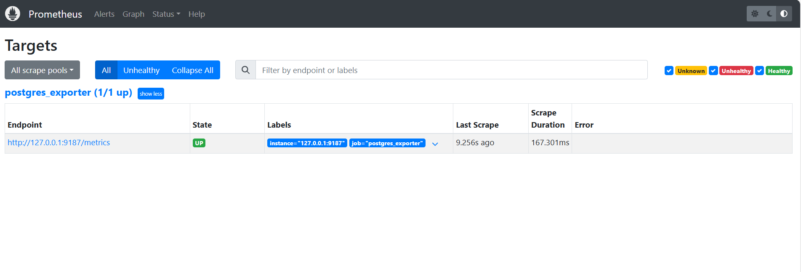

# PostgreSQL Monitoring on OCI with Prometheus and Grafana

## Architecture Overview

* **OCI-managed PostgreSQL**
* **Postgres Exporter** to expose metrics
* **Prometheus** to scrape metrics
* **Grafana** to visualize metrics

---

## Prerequisites

1. **Compute Instance** in a public subnet in the same VCN as the OCI PostgreSQL.
2. **OCI Security List**: Allow inbound ports `9090`, `9187`, `3000`.
3. **Firewall Setup** on instance:

   ```bash
   sudo firewall-cmd --permanent --add-port=9090/tcp
   sudo firewall-cmd --permanent --add-port=9187/tcp
   sudo firewall-cmd --permanent --add-port=3000/tcp
   sudo firewall-cmd --reload
   ```

---

## Step-by-Step Setup

### Step 1: Enable `pg_stat_statements` Extension

Add `pg_stat_statements` on the OCI PostgreSQL configurations via console.

### Step 2: Create Monitoring User

Connect using DBeaver (via Jump Server):

```sql
CREATE USER postgres_exporter WITH PASSWORD '<password>';
GRANT CONNECT ON DATABASE postgres TO postgres_exporter;
GRANT pg_monitor TO postgres_exporter;
```

### Step 3: Install Postgres Exporter

```bash
wget https://github.com/prometheus-community/postgres_exporter/releases/download/v0.15.0/postgres_exporter-0.15.0.linux-amd64.tar.gz

tar -xvf postgres_exporter-0.15.0.linux-amd64.tar.gz

sudo mv postgres_exporter-0.15.0.linux-amd64/postgres_exporter /usr/local/bin/
```

### Step 4: Create Custom `queries.yaml`

```yaml
# Top SQL statements
top_sql_statements:
  query: |
    SELECT query, calls, total_exec_time + total_plan_time AS total_time
    FROM pg_stat_statements
    ORDER BY total_time DESC
    LIMIT 5;
  metrics:
    - query:
        usage: "LABEL"
        description: "SQL query text"
    - calls:
        usage: "COUNTER"
        description: "Number of executions"
    - total_time:
        usage: "GAUGE"
        description: "Total execution + plan time"

# Top users
...
# (Include the rest of your YAML as needed)
```

### Step 5: Set Data Source Environment Variable

```bash
export DATA_SOURCE_NAME="postgresql://postgres_exporter:<password>@<POSTGRES_HOST>:5432/postgres?sslmode=require"
```

### Step 6: Start Postgres Exporter

```bash
nohup /usr/local/bin/postgres_exporter --extend.query-path=/home/opc/queries.yaml --web.listen-address=":9187" > exporter.log 2>&1 &
```

### Step 7: Verify Exporter

```bash
curl http://localhost:9187/metrics
```

---

### Step 8: Install Prometheus

```bash
wget https://github.com/prometheus/prometheus/releases/download/v2.52.0/prometheus-2.52.0.linux-amd64.tar.gz

tar -xvf prometheus-2.52.0.linux-amd64.tar.gz

sudo mv prometheus-2.52.0.linux-amd64/prometheus /usr/local/bin/
sudo mv prometheus-2.52.0.linux-amd64/promtool /usr/local/bin/
```

### Step 9: Create Prometheus Config

Edit `/etc/prometheus/prometheus.yml`:

```yaml
global:
  scrape_interval: 15s

scrape_configs:
  - job_name: 'postgres_exporter'
    static_configs:
      - targets: ['127.0.0.1:9187']
```

### Step 10: Start Prometheus

```bash
nohup prometheus --config.file=/etc/prometheus/prometheus.yml > prometheus.log 2>&1 &
```

### Step 11: Verify Targets

* Visit: `http://<instance_ip>:9090/targets`



---

### Step 12: Install Grafana

```bash
sudo yum install -y https://dl.grafana.com/oss/release/grafana-10.4.2-1.x86_64.rpm
sudo systemctl enable grafana-server
sudo systemctl start grafana-server
```

### Step 13: Login to Grafana

* Visit: `http://<instance_ip>:3000`
* Username: `admin`
* Password: `admin`

### Step 14: Add Data Source in Grafana

* Go to **Settings > Data Sources > Add data source**
* Choose **Prometheus**
* URL: `http://localhost:9090`


### Step 15: Import PostgreSQL Dashboard


* Import dashboard ID: **9628** from Grafana Dashboards

### Step 16: Final Dashboards


* View and customize metrics from your custom queries.yaml
* Add visualizations for:

  * Top queries
  * Top users
  * Active queries
  * Top client IPs
  * Query frequency

---


